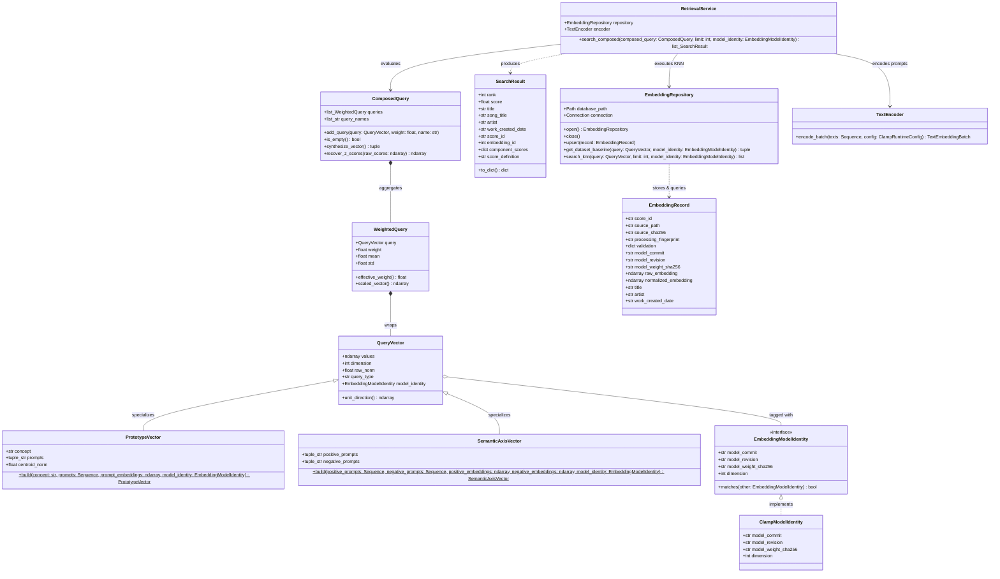
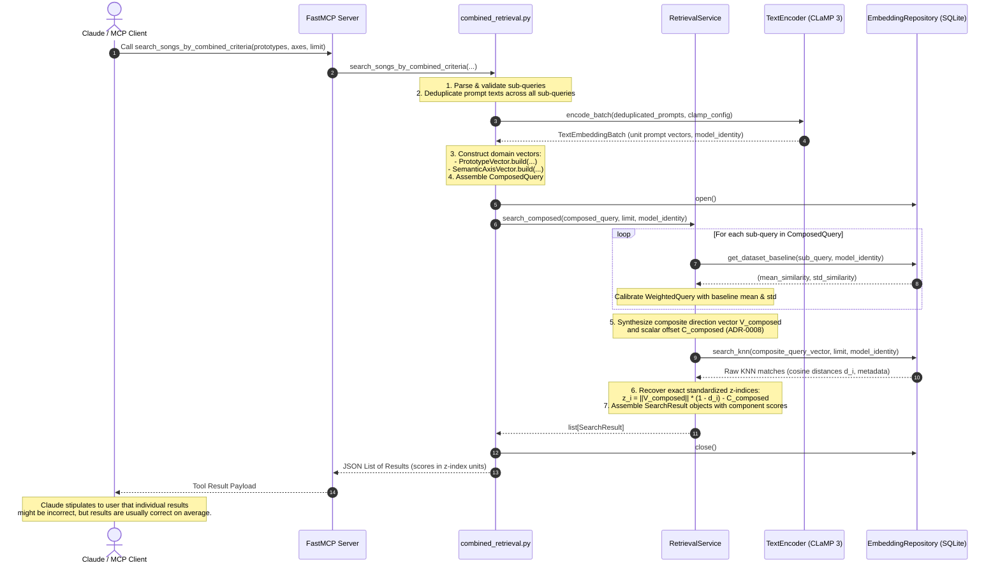
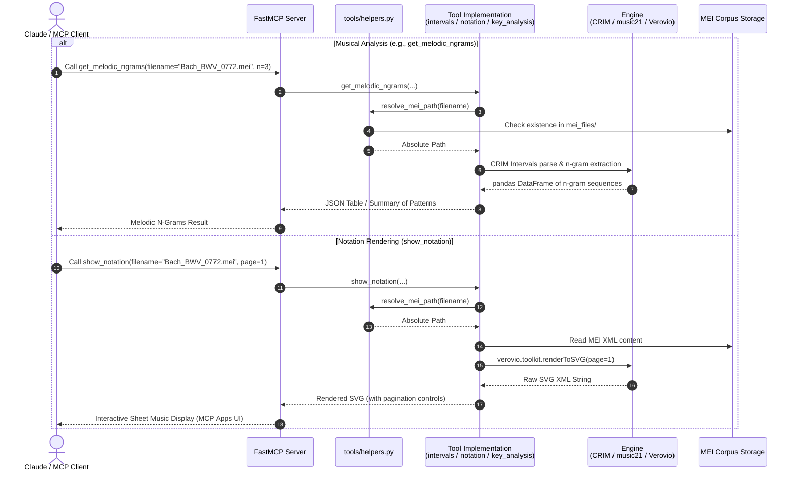

# UML Diagrams — Encoding Music MCP

This document provides formal Unified Modeling Language (UML) specifications for the **Encoding Music MCP** architecture, covering package components, domain classes, sequence interactions, and pipeline lifecycle states.

---

## 1. System Component Diagram

The component diagram illustrates the high-level architecture of Encoding Music MCP, partitioning the system into the MCP Application Layer, Symbolic Analysis Subsystem, Semantic Vector Retrieval Subsystem, and External Storage/Engines.

```mermaid
graph TB
    subgraph ClientLayer["MCP Client Layer"]
        Claude["Claude Desktop / MCP Client"]
    end

    subgraph FastMCPLayer["MCP Application Layer (encoding_music_mcp)"]
        Server["server.py (FastMCP)"]
        ToolReg["tools/registry.py"]
        ResourceReg["resources/registry.py"]
        PromptReg["prompts/registry.py"]
        Server --> ToolReg
        Server --> ResourceReg
        Server --> PromptReg
    end

    subgraph RetrievalSubsystem["Semantic Vector Retrieval Subsystem"]
        CombTool["combined_retrieval.py"]
        ProtoTool["prototype_retrieval.py"]
        AxisTool["semantic_axis_retrieval.py"]
        RetService["score_embeddings/retrieval.py<br/>(RetrievalService)"]
        DomainModel["Domain Models<br/>(ComposedQuery, PrototypeVector, SemanticAxisVector)"]

        CombTool --> RetService
        ProtoTool --> RetService
        AxisTool --> RetService
        CombTool --> DomainModel
        ProtoTool --> DomainModel
        AxisTool --> DomainModel
        RetService --> DomainModel
    end

    subgraph SymbolicSubsystem["Symbolic Analysis Subsystem"]
        IntervalsTool["tools/intervals.py<br/>(notes, intervals, n-grams, cadences)"]
        KeyTool["tools/key_analysis.py<br/>(analyze_key)"]
        MetaTool["tools/metadata.py<br/>(get_mei_metadata)"]
        NotationTool["tools/notation.py<br/>(show_notation)"]
        DiscTool["tools/discovery.py<br/>(list_available_mei_files)"]
        VisualTool["tools/visualisation/<br/>(voice_ranges, heatmaps, progress)"]
    end

    subgraph StorageSubsystem["Domain Storage & Extraction Subsystem"]
        Repo["score_embeddings/storage.py<br/>(EmbeddingRepository)"]
        Encoder["score_embeddings/clamp_extractor.py<br/>(TextEncoder)"]
        Processor["score_embeddings/music_processing.py<br/>(standardize, export, validate)"]
        Pipeline["score_embeddings/pipeline.py<br/>(Batch Pipeline Orchestrator)"]

        RetService --> Repo
        RetService --> Encoder
        Pipeline --> Processor
        Pipeline --> Repo
    end

    subgraph ExternalServices["External Engines & Storage"]
        SQLiteDB[("SQLite + sqlite-vec<br/>score-embeddings.sqlite3")]
        CLaMPWorker["Pinned CLaMP 3 Model Cache & Runtime"]
        VerovioEngine["Verovio Engraving Engine"]
        Music21Lib["music21 Library"]
        CRIMLib["crim-intervals Library"]
        MEIFiles[("MEI Corpus Files<br/>(Bach, Bartók, Morley)")]

        Repo --> SQLiteDB
        Encoder --> CLaMPWorker
        NotationTool --> VerovioEngine
        KeyTool --> Music21Lib
        Processor --> Music21Lib
        IntervalsTool --> CRIMLib
        ResourceReg --> MEIFiles
        DiscTool --> MEIFiles
    end

    Claude <==>|"MCP Protocol (stdio / SSE / HTTP)"| Server
    ToolReg --> CombTool
    ToolReg --> ProtoTool
    ToolReg --> AxisTool
    ToolReg --> IntervalsTool
    ToolReg --> KeyTool
    ToolReg --> MetaTool
    ToolReg --> NotationTool
    ToolReg --> DiscTool
    ToolReg --> VisualTool
```

---

## 2. Unified Vector Domain Class Diagram

This class diagram models the object-oriented structure of the unified vector retrieval domain under **ADR-0008**, **ADR-0006**, and **ADR-0005**, including vector hierarchies, query composition, storage repositories, and retrieval services.

---

## 3. Composed Vector Retrieval Sequence Diagram

This sequence diagram depicts the end-to-end execution of `search_songs_by_combined_criteria` under **ADR-0008**, illustrating prompt consensus, single-batch text encoding, single-vector synthesis, and exact $z$-index score recovery.

---

## 4. Symbolic Analysis & Notation Sequence Diagram

This sequence diagram illustrates the execution flow for symbolic analysis (`intervals.py`, `key_analysis.py`) and dynamic sheet music notation rendering (`notation.py`).

---

## 5. Ingestion Pipeline State Diagram

This state diagram depicts the lifecycle of a symbolic score processed by the standalone whole-score embedding pipeline (`score_embeddings/`).

```mermaid
stateDiagram-v2
    [*] --> Discovered: File identified (*.mei, *.musicxml, *.mxl)
    
    Discovered --> Standardizing: Deep-copy stream & apply default tempo/velocity
    Standardizing --> MusicXMLExported: Deterministic MusicXML (.xml) written to workspace
    
    MusicXMLExported --> Validating: Reparse with music21 & compare NoteEvents
    
    state Validating {
        [*] --> NoteEventCheck
        NoteEventCheck --> ExactMatch: Pitch & duration agree 100%
        NoteEventCheck --> QualifiedMatch: Minor discrepancies within tolerance
        NoteEventCheck --> Mismatch: Note drop or pitch disagreement
    }

    ExactMatch --> ValidatedPass: PASS
    QualifiedMatch --> ValidatedWarning: PASS WITH WARNINGS
    Mismatch --> ValidationFailed: FAIL

    ValidationFailed --> Excluded: Excluded from CLaMP inference; failure logged in DB
    Excluded --> [*]

    ValidatedPass --> FeatureExtraction: Pass validated XML to CLaMP subprocess
    ValidatedWarning --> FeatureExtraction: Pass validated XML to CLaMP subprocess

    FeatureExtraction --> RawEmbeddingProduced: Subprocess outputs 768-dim raw .npy vector
    RawEmbeddingProduced --> L2Normalizing: Validate finite floats & normalize to unit vector
    
    L2Normalizing --> RelationalStorage: Upsert metadata & raw vector into score_embeddings table
    RelationalStorage --> VectorIndexed: Insert unit vector into sqlite-vec virtual table
    
    VectorIndexed --> WorkspaceCleanup: Purge temporary XML workspace files
    WorkspaceCleanup --> ReadyForRetrieval: Score available for KNN search
    ReadyForRetrieval --> [*]
```

